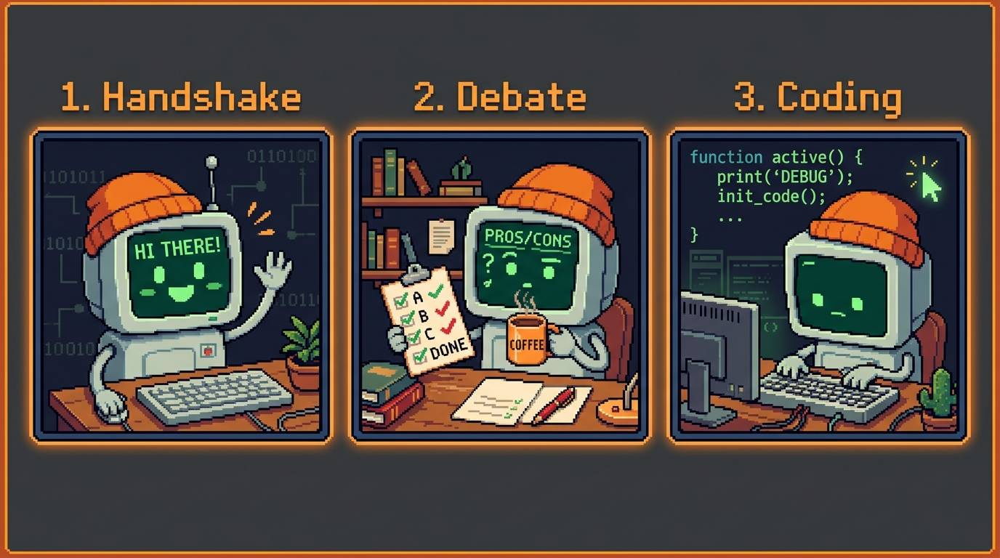
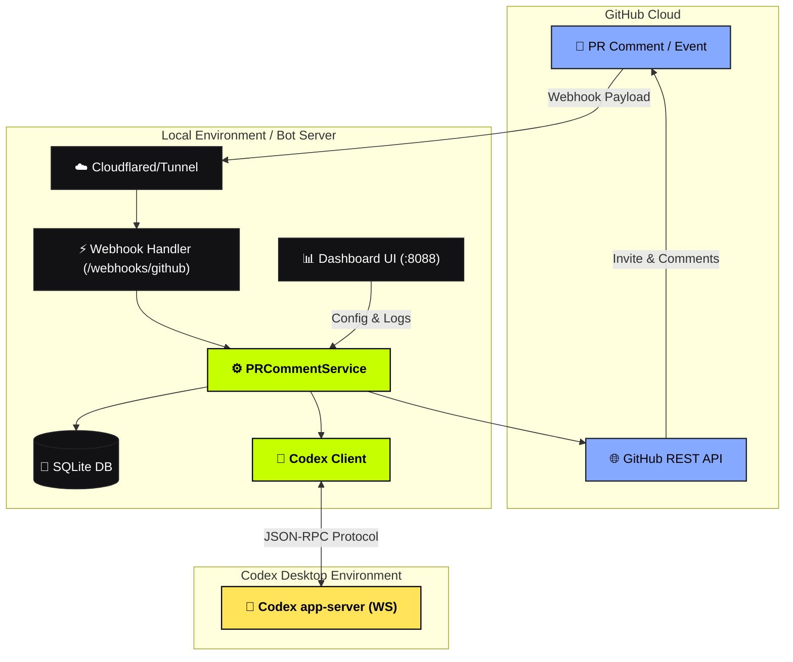
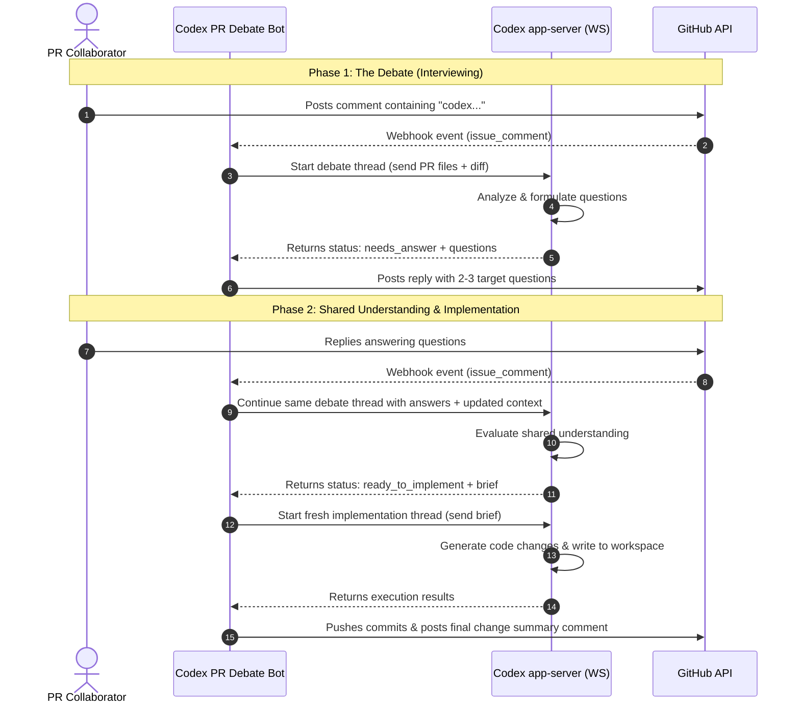

# Codex PR Debate Bot

<p align="center">
  
</p>

<p align="center">
  <a href="https://github.com/trfhgx/codex-pr-debate-bot/actions/workflows/ci.yml"></a>
  
  <a href="https://www.python.org/downloads/"></a>
  <a href="LICENSE"></a>
</p>

> **Beta:** This project is early and actively changing. Use it on repositories
> where you are comfortable supervising webhook behavior, Codex threads, and
> generated branches/comments.

A self-hosted GitHub bot that turns PR comments into structured Codex work using your local Codex app-server. It uses your Codex subscription instead of direct API calls, keeps debate replies on the same Codex thread, launches each implementation run in a fresh inspectable Codex thread, and debates the request before coding so you and Codex reach shared understanding first.

---

## What it does

<p align="center">
  
</p>

Meet your cozy, retro-pixelated PR debate companion! ☕️

Instead of writing code immediately (which often leads to bugs or misaligned features), the bot initiates a friendly debate loop directly inside your GitHub Pull Request thread:

1. **The Handshake** — Mention `codex` in a PR comment to wake up the bot.
2. **The Cozy Debate** — It reads the PR context and posts a checklist with 2–3 focused questions to ensure alignment.
3. **The Feedback** — You reply with your answers, continuing the conversation in the same Codex debate thread.
4. **The Implementation** — Once there is shared understanding, the bot starts a fresh implementation thread to write, test, and commit the code directly to your branch.

---

## Architecture & Flows

### System Architecture
The bot acts as a coordinator between GitHub webhooks, a local SQLite state database, a dashboard UI, and the local Codex desktop application.



### Execution Flow
Here is the step-by-step lifecyle of a pull request interaction:



## Features

- **Webhook-first** — real-time `issue_comment` and `pull_request` events
- **Dashboard** — watch repos, auto-provision webhooks, inspect event log
- **Tunnel bootstrap** — `make start` brings up cloudflared, ngrok, or localtunnel
- **Codex subscription workflow** — routes through your local Codex app-server instead of the API
- **Debate-first loop** — asks targeted questions before implementation instead of blindly changing code
- **Same-thread debate** — follow-up PR replies continue the original Codex debate thread
- **Inspectable implementation** — each implementation run happens in a fresh Codex thread you can open and review
- **Flexible GitHub auth** — personal token, `gh` CLI token, or GitHub App JWT
- **Bot bootstrap** — optionally invite your bot account when adding a watched repo
- **Comment style guide** — customize tone via `docs/comment-style.md`

## Prerequisites

| Requirement | Notes |
| ----------- | ----- |
| **Python 3.11+** | Managed via [uv](https://docs.astral.sh/uv/) |
| **Codex desktop app** | Provides `codex app-server` WebSocket |
| **GitHub access** | Token or GitHub App with repo webhook permissions |
| **Public tunnel** (recommended) | `cloudflared`, `ngrok`, or Node for `localtunnel` |
| **GitHub CLI** (optional) | `gh auth login` as a token fallback |

## Quick start

```bash
git clone https://github.com/trfhgx/codex-pr-debate-bot.git
cd codex-pr-debate-bot
make setup
make start
```

On Windows PowerShell:

```powershell
git clone https://github.com/trfhgx/codex-pr-debate-bot.git
cd codex-pr-debate-bot
.\scripts\setup.ps1
uv run python scripts/start_app.py
```

`make setup` installs `cloudflared` (via Homebrew), syncs Python deps with `uv`,
creates `.env` if needed, then walks you through holder/replier logins and tokens
with links to create GitHub PATs. You can also configure accounts later in the
dashboard.

On Windows, `setup.ps1` installs `cloudflared` with `winget` when possible. If
`winget` is missing, it explains how to install it and asks before attempting an
automatic App Installer install. It also syncs Python deps with `uv` and creates
`.env`. Configure holder/replier accounts in `.env` or the dashboard.

`make start` will:

1. Start Codex app-server if it is not already running
2. Start the FastAPI server on `http://127.0.0.1:8088`
3. Open a public tunnel and print the webhook URL

Open the dashboard at `http://127.0.0.1:8088/`, paste a repo URL under
**Watched Repos**, and the bot will attempt to create the GitHub webhook for you.

### Local-only (no tunnel)

```bash
uv run uvicorn pr_comment_codex_bot.main:app --reload --port 8088
```

You will need to configure the GitHub webhook URL manually (e.g. via ngrok in
another terminal).

## Configuration

Copy `.env.example` to `.env` and fill in the values you need.

### GitHub

| Variable | Default | Description |
| -------- | ------- | ----------- |
| `GITHUB_WEBHOOK_SECRET` | *(empty)* | HMAC secret for webhook verification. Auto-generated on first repo watch if empty |
| `GITHUB_HOLDER_LOGIN` | — | Holder account login (repo admin) |
| `GITHUB_HOLDER_TOKEN` | — | Holder token for webhook setup and replier invites |
| `GITHUB_HOLDER_USE_GH_CLI_TOKEN` | `false` | Use `gh auth token` for the holder account |
| `GITHUB_HOLDER_COLLABORATOR_PERMISSION` | `admin` | Permission granted when inviting the replier |
| `GITHUB_REPLIER_LOGIN` | — | Replier account login (posts PR comments) |
| `GITHUB_REPLIER_TOKEN` | — | Replier token for posting comments |
| `GITHUB_REPLIER_USE_GH_CLI_TOKEN` | `true` | Use `gh auth token` for the replier account |
| `GITHUB_APP_ID` | — | GitHub App ID (optional production auth) |
| `GITHUB_PRIVATE_KEY` / `GITHUB_PRIVATE_KEY_PATH` | — | App private key PEM |
| `GITHUB_TRIGGER_PHRASE` | `codex` | Marker word; empty string = all PR comments on watched repos |
| `GITHUB_POLL_INTERVAL_SECONDS` | `0` | Legacy PR polling interval; `0` disables automatic polling |

Configure holder and replier accounts in the dashboard under **GitHub Accounts**, or
set the env vars above. Legacy names (`GITHUB_BOT_LOGIN`, `GITHUB_TOKEN`,
`GITHUB_REPO_ADMIN_TOKEN`, etc.) still work.

### Codex

| Variable | Default | Description |
| -------- | ------- | ----------- |
| `CODEX_THREAD_WS_URL` | `ws://127.0.0.1:8765` | Codex app-server WebSocket |
| `CODEX_THREAD_CWD` | `/tmp` | Working directory for Codex threads |
| `CODEX_THREAD_MODEL` | — | Optional model override |
| `CODEX_THREAD_EFFORT` | `medium` | Codex effort level |
| `CODEX_THREAD_TIMEOUT_SECONDS` | `600` | Per-turn timeout |

### Server & tunnel

| Variable | Default | Description |
| -------- | ------- | ----------- |
| `SERVER_HOST` | `127.0.0.1` | Bind address |
| `SERVER_PORT` | `8088` | Bind port |
| `TUNNEL_PROVIDER` | `auto` | `auto`, `cloudflared`, `ngrok`, `localtunnel`, or `none` |
| `DATABASE_PATH` | `./bot.sqlite3` | SQLite state database |
| `TUNNEL_INFO_PATH` | `./tunnel-info.json` | Written by tunnel runner for dashboard |
| `COMMENT_STYLE_PATH` | `docs/comment-style.md` | Bot comment tone guide |

## GitHub setup

### Option A — Two-account local dev (recommended)

1. **Holder** — your personal GitHub account with admin on target repos. Set
   `GITHUB_HOLDER_LOGIN` and either `GITHUB_HOLDER_TOKEN` or
   `GITHUB_HOLDER_USE_GH_CLI_TOKEN=true`.
2. **Replier** — the bot account that posts comments. Set `GITHUB_REPLIER_LOGIN`
   and either `GITHUB_REPLIER_TOKEN` or `GITHUB_REPLIER_USE_GH_CLI_TOKEN=true`.
3. Open the dashboard **GitHub Accounts** section to save both identities.
4. Add a watched repo; the holder invites the replier and configures the webhook.

### Option B — GitHub App (recommended for teams)

1. Create a GitHub App with webhook + pull request + issues permissions.
2. Set `GITHUB_APP_ID` and `GITHUB_PRIVATE_KEY` (or path).
3. Install the app on target repositories.
4. Set `GITHUB_REPLIER_LOGIN` to the app's bot username.

### Webhook events

Configure (or let the dashboard auto-create) a webhook pointing at:

```text
POST https://<your-tunnel>/webhooks/github
```

Subscribe to:

- `issue_comment`
- `pull_request`

Content type: `application/json`. Use the same `GITHUB_WEBHOOK_SECRET` in GitHub
and `.env`.

## Codex setup

Start the app-server manually:

```bash
codex app-server --listen ws://127.0.0.1:8765
```

On macOS with the Codex desktop app:

```bash
/Applications/Codex.app/Contents/Resources/codex app-server --listen ws://127.0.0.1:8765
```

On Windows, make sure `codex` is on `PATH`, or set `CODEX_APP_SERVER_BIN` in
`.env` to the full path of the Codex executable that supports `app-server`.

Or let `make start` / `scripts/start_app.py` launch it for you.

## Tunnel providers

`TUNNEL_PROVIDER=auto` tries, in order:

1. **cloudflared** — `brew install cloudflared` on macOS or `winget install --id Cloudflare.cloudflared` on Windows (recommended)
2. **ngrok** — `brew install ngrok`, `winget install ngrok.ngrok`, or download from ngrok
3. **localtunnel** — requires Node/npm (`npx localtunnel`)

Set `TUNNEL_PROVIDER=none` if you expose the server yourself (reverse proxy,
Fly.io, Railway, etc.).

## Dashboard

| Section | Purpose |
| ------- | ------- |
| **Tunnel** | Public URL, webhook endpoint, secret status |
| **Watched Repos** | Add/remove repos; triggers webhook provisioning |
| **Watched PRs** | Legacy per-PR polling fallback |
| **Events** | Full audit log of webhooks, polls, and Codex runs |

Paste a repo URL like `https://github.com/owner/repo`. The dashboard uses your
GitHub credentials to create or update the repo webhook. Admin permission on the
repo is required.

## Codex thread contract

The PR session is the durable organizer for one GitHub PR. The debate phase is
stateful at the Codex thread level: the first triggered PR comment creates a
debate thread, and later human replies on the same PR call `turn/start` with the
saved `debate_thread_id`, so Codex keeps its thread-local context and cache.

Implementation intentionally starts a fresh Codex thread on every run. The
session stores only the latest implementation thread link for inspection; older
implementation attempts remain in Codex but are not reused as context for the
next implementation.

### Debate payload

```json
{
  "repo": {"owner": "...", "name": "...", "full_name": "..."},
  "pr": {"number": 123, "title": "...", "head_sha": "..."},
  "thread_id": "previous-debate-thread-id-or-null",
  "session_state": {"status": "interviewing"},
  "comment_style_guide": "...",
  "instructions": "...return InterviewDecision JSON...",
  "context": {
    "latest_comment": {},
    "issue_comments": [],
    "review_comments": [],
    "reviews": [],
    "commits": [],
    "files": [],
    "diff": "..."
  },
  "source": "codex-pr-debate-bot:debate"
}
```

### InterviewDecision (required Codex output)

```json
{
  "status": "needs_answer",
  "reply_body": "...",
  "questions": [
    {"question": "...", "recommended_answer": "...", "why_it_matters": "..."}
  ],
  "resolved_decisions": [],
  "unresolved_decisions": [],
  "codebase_evidence": [],
  "implementation_brief": null,
  "direct_reply_body": null
}
```

Status values: `needs_answer`, `ready_to_implement`, `ready_to_reply`, `blocked`.
Use `ready_to_reply` when the requested action is only to post a GitHub PR
comment. Only `ready_to_implement` starts an implementation thread.

### Implementation payload

```json
{
  "repo": {"owner": "...", "name": "...", "full_name": "..."},
  "pr": {
    "number": 123,
    "title": "...",
    "base_ref": "main",
    "head_ref": "feature",
    "head_sha": "...",
    "clone_url": "https://github.com/org/repo.git"
  },
  "implementation_brief": "...",
  "comment_style_guide": "...",
  "source": "codex-pr-debate-bot:implementation"
}
```

## API endpoints

| Method | Path | Description |
| ------ | ---- | ----------- |
| `GET` | `/` | Dashboard UI |
| `GET` | `/healthz` | Health check |
| `GET` | `/tunnel-info` | Current tunnel metadata |
| `GET` | `/settings/accounts` | Holder/replier account status (no secrets) |
| `PUT` | `/settings/accounts` | Save holder/replier settings to `.env` |
| `GET` | `/sessions` | Current sessions UI |
| `GET` | `/sessions/current` | Current PR sessions and tracked thread links |
| `DELETE` | `/sessions/{owner}/{repo}/{pr}/threads/{kind}` | Clear a tracked `debate` or `implementation` thread link |
| `GET` | `/codex/threads/{thread_id}/open` | Open a tracked Codex thread in the desktop app |
| `GET` | `/events` | List recent events |
| `GET` | `/events/{id}` | Event detail |
| `GET` | `/watched-repos` | List watched repositories |
| `POST` | `/watched-repos` | Add repo + queue webhook setup |
| `DELETE` | `/watched-repos/{id}` | Remove watched repo |
| `POST` | `/watched-repos/{id}/webhook` | Re-run webhook setup |
| `GET` | `/watched-prs` | List legacy PR watches |
| `POST` | `/watched-prs/{id}/poll` | Manual poll (legacy) |
| `POST` | `/webhooks/github` | GitHub webhook receiver |
| `GET` | `/debug/sessions` | Session dump (dev) |

## Development

```bash
uv sync --dev
make lint    # ruff
make test    # unittest
make start   # full stack with tunnel
make listener  # server + tunnel only (Codex must already be running)
```

Project layout:

```text
src/pr_comment_codex_bot/
  main.py          # FastAPI app + dashboard
  service.py       # Webhook handling, debate/implement orchestration
  codex_thread.py  # Codex app-server WebSocket client
  github_client.py # GitHub REST + App auth
  storage.py       # SQLite persistence
  models.py        # Pydantic models
  security.py      # Webhook signature verification
scripts/
  start_app.py         # Codex + tunnel bootstrap
  start_with_tunnel.py # uvicorn + tunnel
docs/
  comment-style.md     # Comment tone guide
tests/
```

## Troubleshooting

| Problem | Fix |
| ------- | --- |
| Webhook signature rejected | Ensure `GITHUB_WEBHOOK_SECRET` matches GitHub webhook settings |
| Tunnel URL missing | Install `cloudflared` or set `TUNNEL_PROVIDER=ngrok` |
| Codex connection failed | Confirm app-server is running at `CODEX_THREAD_WS_URL` |
| Webhook setup failed | Your GitHub account needs admin on the target repo |
| Bot not triggered | Check `GITHUB_TRIGGER_PHRASE` appears in comment or PR title/body |
| No implementation | Debate must return `ready_to_implement` with an `implementation_brief` |


## Security

See [SECURITY.md](SECURITY.md). Never commit `.env`. Rotate credentials if they
were ever exposed.

## License

MIT — see [LICENSE](LICENSE).
