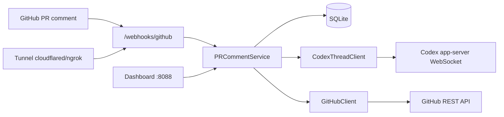

# PR Comment Codex Bot

[](https://github.com/YOUR_ORG/pr-comment-codex-bot/actions/workflows/ci.yml)
[](https://www.python.org/downloads/)
[](LICENSE)

A self-hosted GitHub bot that turns PR comments into structured Codex work. When
someone comments on a pull request, the bot interviews them through a debate
thread, then launches a Codex implementation thread once there is shared
understanding.

Codex work runs through the **official Codex app-server JSON-RPC protocol**
(`thread/start`, `turn/start`) — not direct `/v1/responses` calls.

## What it does

| Stage | What happens |
| ----- | ------------ |
| **Trigger** | A PR comment (or PR title/body) contains your marker phrase, default `codex` |
| **Debate** | Codex reads the full PR context and asks 2–3 focused questions with recommended answers |
| **Implement** | When status is `ready_to_implement`, Codex runs an implementation thread |
| **Reply** | The bot posts GitHub comments with questions, progress, and a final summary |

## Architecture



```text
GitHub issue_comment / pull_request webhook
  → SQLite session + event log
  → Codex debate thread (read-only sandbox)
  → GitHub reply with questions or implementation start
  → Codex implementation thread
  → GitHub final change summary
```

## Features

- **Webhook-first** — real-time `issue_comment` and `pull_request` events
- **Dashboard** — watch repos, auto-provision webhooks, inspect event log
- **Tunnel bootstrap** — `make start` brings up cloudflared, ngrok, or localtunnel
- **Debate → implement** — two-phase Codex flow with persisted session state
- **Flexible GitHub auth** — personal token, `gh` CLI token, or GitHub App JWT
- **Bot bootstrap** — optionally invite your bot account when adding a watched repo
- **Comment style guide** — customize tone via `docs/comment-style.md`

## Prerequisites

| Requirement | Notes |
| ----------- | ----- |
| **Python 3.11+** | Managed via [uv](https://docs.astral.sh/uv/) |
| **Codex desktop app** | Provides `codex app-server` WebSocket |
| **GitHub access** | Token or GitHub App with repo webhook permissions |
| **Public tunnel** (recommended) | `cloudflared`, `ngrok`, or Node for `localtunnel` |
| **GitHub CLI** (optional) | `gh auth login` as a token fallback |

## Quick start

```bash
git clone https://github.com/YOUR_ORG/pr-comment-codex-bot.git
cd pr-comment-codex-bot
cp .env.example .env
uv sync
make start
```

`make start` will:

1. Start Codex app-server if it is not already running
2. Start the FastAPI server on `http://127.0.0.1:8088`
3. Open a public tunnel and print the webhook URL

Open the dashboard at `http://127.0.0.1:8088/`, paste a repo URL under
**Watched Repos**, and the bot will attempt to create the GitHub webhook for you.

### Local-only (no tunnel)

```bash
uv run uvicorn pr_comment_codex_bot.main:app --reload --port 8088
```

You will need to configure the GitHub webhook URL manually (e.g. via ngrok in
another terminal).

## Configuration

Copy `.env.example` to `.env` and fill in the values you need.

### GitHub

| Variable | Default | Description |
| -------- | ------- | ----------- |
| `GITHUB_WEBHOOK_SECRET` | *(empty)* | HMAC secret for webhook verification. Auto-generated on first repo watch if empty |
| `GITHUB_TOKEN` | — | Personal access token or fine-grained token |
| `GITHUB_USE_GH_CLI_TOKEN` | `true` | Fall back to `gh auth token` when no token is set |
| `GITHUB_APP_ID` | — | GitHub App ID (recommended for production) |
| `GITHUB_PRIVATE_KEY` / `GITHUB_PRIVATE_KEY_PATH` | — | App private key PEM |
| `GITHUB_BOT_LOGIN` | — | Bot account to invite when adding watched repos |
| `GITHUB_REPO_ADMIN_TOKEN` | — | Admin token for collaborator bootstrap |
| `GITHUB_REPO_ADMIN_USE_GH_CLI_TOKEN` | `false` | Use `gh auth token` for admin bootstrap |
| `GITHUB_TRIGGER_PHRASE` | `codex` | Marker word; empty string = all PR comments on watched repos |
| `GITHUB_POLL_INTERVAL_SECONDS` | `0` | Legacy PR polling interval; `0` disables automatic polling |

### Codex

| Variable | Default | Description |
| -------- | ------- | ----------- |
| `CODEX_THREAD_WS_URL` | `ws://127.0.0.1:8765` | Codex app-server WebSocket |
| `CODEX_THREAD_CWD` | `/tmp` | Working directory for Codex threads |
| `CODEX_THREAD_MODEL` | — | Optional model override |
| `CODEX_THREAD_EFFORT` | `medium` | Codex effort level |
| `CODEX_THREAD_TIMEOUT_SECONDS` | `600` | Per-turn timeout |

### Server & tunnel

| Variable | Default | Description |
| -------- | ------- | ----------- |
| `SERVER_HOST` | `127.0.0.1` | Bind address |
| `SERVER_PORT` | `8088` | Bind port |
| `TUNNEL_PROVIDER` | `auto` | `auto`, `cloudflared`, `ngrok`, `localtunnel`, or `none` |
| `DATABASE_PATH` | `./bot.sqlite3` | SQLite state database |
| `TUNNEL_INFO_PATH` | `./tunnel-info.json` | Written by tunnel runner for dashboard |
| `COMMENT_STYLE_PATH` | `docs/comment-style.md` | Bot comment tone guide |

## GitHub setup

### Option A — Personal token (fastest for local dev)

1. Create a token with `repo` scope (or fine-grained repo admin + webhook).
2. Set `GITHUB_TOKEN` in `.env`, or run `gh auth login` and leave
   `GITHUB_USE_GH_CLI_TOKEN=true`.
3. Start the bot and add your repo in the dashboard.

### Option B — GitHub App (recommended for teams)

1. Create a GitHub App with webhook + pull request + issues permissions.
2. Set `GITHUB_APP_ID` and `GITHUB_PRIVATE_KEY` (or path).
3. Install the app on target repositories.
4. Set `GITHUB_BOT_LOGIN` to the app's bot username.

### Webhook events

Configure (or let the dashboard auto-create) a webhook pointing at:

```text
POST https://<your-tunnel>/webhooks/github
```

Subscribe to:

- `issue_comment`
- `pull_request`

Content type: `application/json`. Use the same `GITHUB_WEBHOOK_SECRET` in GitHub
and `.env`.

## Codex setup

Start the app-server manually:

```bash
codex app-server --listen ws://127.0.0.1:8765
```

On macOS with the Codex desktop app:

```bash
/Applications/Codex.app/Contents/Resources/codex app-server --listen ws://127.0.0.1:8765
```

Or let `make start` / `scripts/start_app.py` launch it for you.

## Tunnel providers

`TUNNEL_PROVIDER=auto` tries, in order:

1. **cloudflared** — `brew install cloudflared` (recommended)
2. **ngrok** — `brew install ngrok`
3. **localtunnel** — requires Node/npm (`npx localtunnel`)

Set `TUNNEL_PROVIDER=none` if you expose the server yourself (reverse proxy,
Fly.io, Railway, etc.).

## Dashboard

| Section | Purpose |
| ------- | ------- |
| **Tunnel** | Public URL, webhook endpoint, secret status |
| **Watched Repos** | Add/remove repos; triggers webhook provisioning |
| **Watched PRs** | Legacy per-PR polling fallback |
| **Events** | Full audit log of webhooks, polls, and Codex runs |

Paste a repo URL like `https://github.com/owner/repo`. The dashboard uses your
GitHub credentials to create or update the repo webhook. Admin permission on the
repo is required.

## Codex thread contract

### Debate payload

```json
{
  "repo": {"owner": "...", "name": "...", "full_name": "..."},
  "pr": {"number": 123, "title": "...", "head_sha": "..."},
  "thread_id": "previous-debate-thread-id-or-null",
  "session_state": {"status": "interviewing"},
  "comment_style_guide": "...",
  "instructions": "...return InterviewDecision JSON...",
  "context": {
    "latest_comment": {},
    "issue_comments": [],
    "review_comments": [],
    "reviews": [],
    "commits": [],
    "files": [],
    "diff": "..."
  },
  "source": "pr-comment-codex-bot:debate"
}
```

### InterviewDecision (required Codex output)

```json
{
  "status": "needs_answer",
  "reply_body": "...",
  "questions": [
    {"question": "...", "recommended_answer": "...", "why_it_matters": "..."}
  ],
  "resolved_decisions": [],
  "unresolved_decisions": [],
  "codebase_evidence": [],
  "implementation_brief": null
}
```

Status values: `needs_answer`, `ready_to_implement`, `blocked`.

### Implementation payload

```json
{
  "repo": {"owner": "...", "name": "...", "full_name": "..."},
  "pr": {
    "number": 123,
    "title": "...",
    "base_ref": "main",
    "head_ref": "feature",
    "head_sha": "...",
    "clone_url": "https://github.com/org/repo.git"
  },
  "implementation_brief": "...",
  "comment_style_guide": "...",
  "source": "pr-comment-codex-bot"
}
```

## API endpoints

| Method | Path | Description |
| ------ | ---- | ----------- |
| `GET` | `/` | Dashboard UI |
| `GET` | `/healthz` | Health check |
| `GET` | `/tunnel-info` | Current tunnel metadata |
| `GET` | `/events` | List recent events |
| `GET` | `/events/{id}` | Event detail |
| `GET` | `/watched-repos` | List watched repositories |
| `POST` | `/watched-repos` | Add repo + queue webhook setup |
| `DELETE` | `/watched-repos/{id}` | Remove watched repo |
| `POST` | `/watched-repos/{id}/webhook` | Re-run webhook setup |
| `GET` | `/watched-prs` | List legacy PR watches |
| `POST` | `/watched-prs/{id}/poll` | Manual poll (legacy) |
| `POST` | `/webhooks/github` | GitHub webhook receiver |
| `GET` | `/debug/sessions` | Session dump (dev) |

## Development

```bash
uv sync --dev
make lint    # ruff
make test    # unittest
make start   # full stack with tunnel
make listener  # server + tunnel only (Codex must already be running)
```

Project layout:

```text
src/pr_comment_codex_bot/
  main.py          # FastAPI app + dashboard
  service.py       # Webhook handling, debate/implement orchestration
  codex_thread.py  # Codex app-server WebSocket client
  github_client.py # GitHub REST + App auth
  storage.py       # SQLite persistence
  models.py        # Pydantic models
  security.py      # Webhook signature verification
scripts/
  start_app.py         # Codex + tunnel bootstrap
  start_with_tunnel.py # uvicorn + tunnel
docs/
  comment-style.md     # Comment tone guide
tests/
```

## Troubleshooting

| Problem | Fix |
| ------- | --- |
| Webhook signature rejected | Ensure `GITHUB_WEBHOOK_SECRET` matches GitHub webhook settings |
| Tunnel URL missing | Install `cloudflared` or set `TUNNEL_PROVIDER=ngrok` |
| Codex connection failed | Confirm app-server is running at `CODEX_THREAD_WS_URL` |
| Webhook setup failed | Your GitHub account needs admin on the target repo |
| Bot not triggered | Check `GITHUB_TRIGGER_PHRASE` appears in comment or PR title/body |
| No implementation | Debate must return `ready_to_implement` with an `implementation_brief` |

## Setup difficulty

**Moderate** — not a one-click SaaS, but workable for a developer machine.

| Piece | Difficulty | Why |
| ----- | ---------- | --- |
| Python + uv | Easy | Standard tooling |
| GitHub token | Easy | `gh auth login` works out of the box |
| Codex app-server | Medium | Requires Codex desktop app installed and running |
| Public tunnel | Easy–Medium | `brew install cloudflared && make start` |
| GitHub App (prod) | Medium | More setup, better for multi-repo teams |
| Persistent hosting | Hard | Needs always-on server + stable URL + Codex runtime |

**Fastest path:** macOS laptop, `gh auth login`, Codex app installed,
`brew install cloudflared`, `make start`, add repo in dashboard.

## What's still missing for production

These are not blockers for open-sourcing, but worth knowing before running at
scale:

- [ ] **Hosted deployment guide** — Docker, Fly.io, or Railway example
- [ ] **GitHub App manifest / setup script** — automated app creation
- [ ] **Rate limiting** on webhook and dashboard endpoints
- [ ] **Authentication** on dashboard and debug routes (currently open locally)
- [ ] **Multi-installation GitHub App** routing (installation ID from webhook)
- [ ] **Metrics / observability** — structured logging, OpenTelemetry
- [ ] **CHANGELOG** and release tagging workflow
- [ ] **PyPI publish** — optional; currently run from source

## Security

See [SECURITY.md](SECURITY.md). Never commit `.env`. Rotate credentials if they
were ever exposed.

## License

MIT — see [LICENSE](LICENSE).